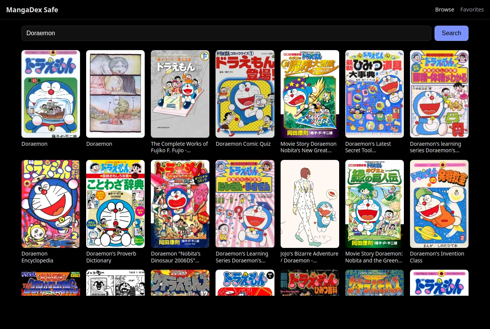
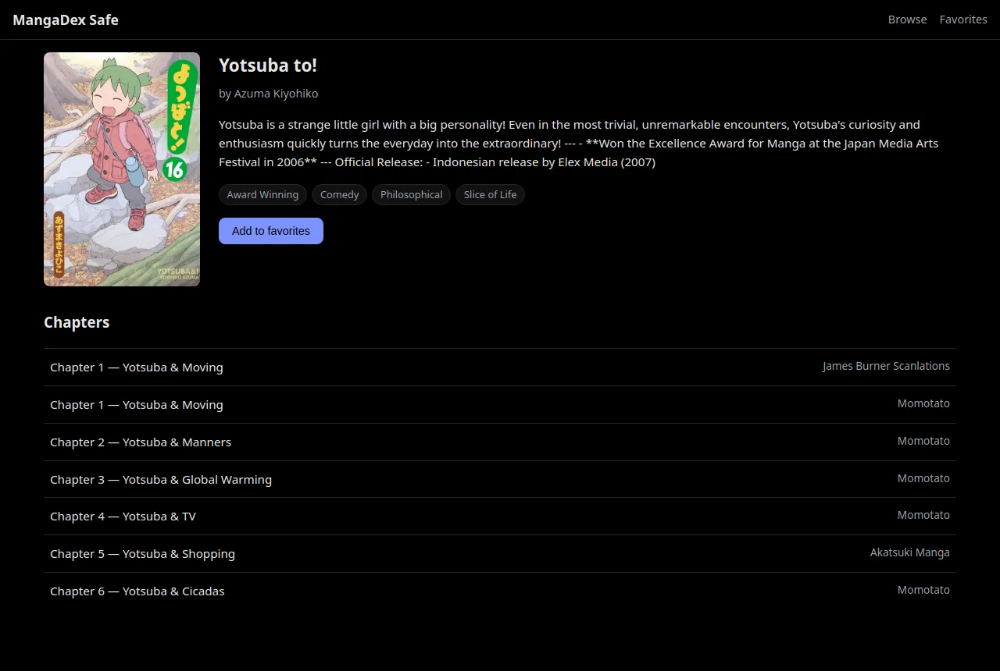
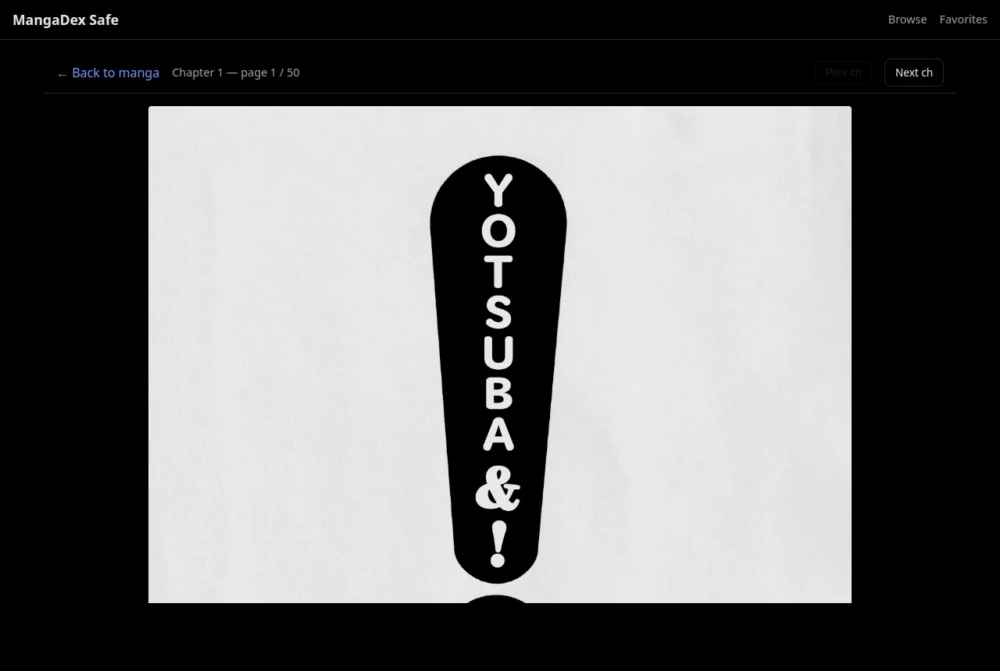
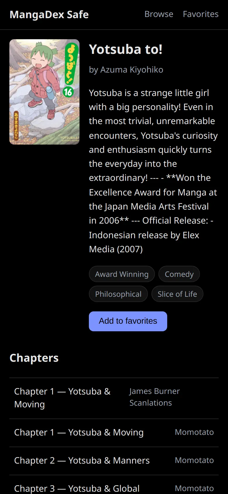

# safe-otaku

Network-level tools for an anime/manga household that doesn't want NSFW content, built to run on an OpenWrt router.

Most otaku sites mix safe and NSFW content (ecchi, hentai, explicit manga) and offer no way to filter it that a network can enforce. Personal settings can be switched off, and browser extensions only cover one device. This project works at the router instead:

1. **A safe MangaDex reader.** A small web app served by the router, with every request passing through a filtering proxy on the router. Only `safe` and `suggestive` titles are shown, Boys' Love and Girls' Love titles are excluded, and editing URLs cannot get around it.
2. **Blocklists for adblock-lean.** About 1,300 NSFW anime, manga and related sites that the [Hagezi NSFW](https://github.com/hagezi/dns-blocklists) list doesn't cover. They come from three audited sources: [everythingmoe](https://everythingmoe.com), the extension repos that reader apps install sources from, and [fmhy](https://fmhy.net). Every entry is backed by recorded evidence.

Everything runs on hardware you already have. The reader needs no extra packages: it is a shell-script CGI on the router's existing web server plus a frontend under 12 KB gzipped. The blocklists are plain domain lists for [adblock-lean](https://github.com/lynxthecat/adblock-lean).

## The MangaDex reader

- Browse and search MangaDex, read chapters, keep favorites and reading position (stored in the browser).
- Licensed series that MangaDex only links to open on the publisher's official site.
- No accounts, no tracking, no router-side cache. Content ratings and excluded tags are enforced in the proxy, not by hiding things in the UI.

It is a separate site on your network, not a filter in front of `mangadex.org`. Block the real site with the blocklists, or anyone can still open it.

| Search | Title page |
|---|---|
|  |  |

| Reader | On a phone |
|---|---|
|  |  |

## Quick start

On a development machine with Node.js 18+:

```
npm install
npm run build
```

Then copy the app to the router and verify it, as described in [docs/install.md](docs/install.md). Deploy the blocklists as described in [blocklist/README.md](blocklist/README.md#deploy).

## Documentation

| | |
|---|---|
| [docs/install.md](docs/install.md) | Installing on the router, a short `manga.lan` name, troubleshooting |
| [docs/how-it-works.md](docs/how-it-works.md) | Architecture, how the content filter is enforced, security notes, footprint |
| [blocklist/README.md](blocklist/README.md) | What the blocklists cover, how sites were classified, deployment, limits |
| [docs/development.md](docs/development.md) | Commands, local development server, project layout |
| [AGENT.md](AGENT.md) | Constraints, rules for changes and tests, for contributors and coding agents |
| [docs/policies/](docs/policies/) | The engineering policies the project follows |

## Disclaimer

This project is not affiliated with or endorsed by MangaDex. It uses the public [MangaDex API](https://api.mangadex.org/docs/) and proxies requests as the API documentation requires. MangaDex's terms apply to the content it serves.

The blocklists reflect one household's rules (see [blocklist/README.md](blocklist/README.md)). The classification evidence is in the TSV files, so you can adapt them to your own rules.

## License

[AGPL-3.0-or-later](LICENSE).
